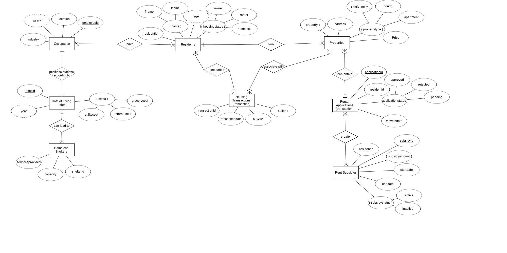
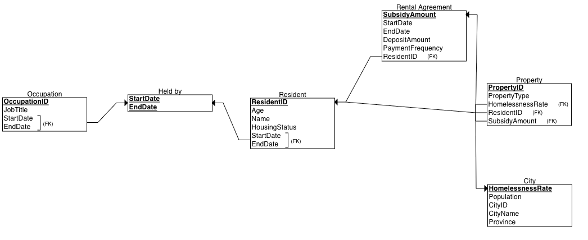

# BSAD384 Term Project

## Ottawa's Housing and Affordability Crisis Operational Database

This project focuses on the growing issue of housing affordability in Ottawa and aims to address it through the design of a well-structured relational database. The system models key components of the housing ecosystem, including residents, properties, rental agreements, occupations and the city of Ottawa itself. It incorporates both a conceptual and logical data model to visualize relationships and ensure data normalization. The goal is to enable analysis that can inform decisions made by city officials, housing organizations, and social service providers. The database captures information such as resident demographics, employment history, rental details, subsidy distribution, and city-level homelessness rates. Sample SQL queries are included to showcase the kind of insights that can be generated, such as total subsidy amounts, average homelessness rates by city, and residents with multiple occupations. The project is designed for analytical and educational purposes and does not currently integrate real-time data sources or user-facing applications. It does not attempt to provide policy recommendations or financial forecasting. The scope is limited to database design, ER diagram development, and query generation for analysis. The project leverages realistic data structures and relationships to simulate a functioning housing information system. By organizing data around residents and their housing journeys, it highlights the complexity of affordability and support systems in urban areas. Ultimately, this project serves as a foundation for further work in housing data analysis and informed policymaking. 

---

## Entity Relational Model


---

## Relational Model


---

## Source Code
* [Create Script](createscript.txt)
* [Populate Script](populatescript.txt)


---

## Sample Queries

```sql
-- Query 1: List all residents and their current rental agreement details
SELECT r.ResidentID, r.Name, ra.PropertyID, ra.StartDate, ra.EndDate
FROM Resident r
LEFT JOIN Rental_Agreement ra 
    ON r.ResidentID = ra.ResidentID 
    AND (ra.EndDate IS NULL OR ra.EndDate >= GETDATE());

-- Query 2: List all properties with their city and current resident name
SELECT p.PropertyID, p.PropertyType, c.CityName, r.Name AS CurrentResident
FROM Property p
JOIN City_Subsidy_Rate c 
    ON p.CityID = c.CityID
LEFT JOIN Resident r 
    ON p.ResidentID = r.ResidentID;

-- Query 3: Calculate the total subsidy amount for each resident
SELECT r.ResidentID, r.Name, SUM(ra.SubsidyAmount) AS TotalSubsidy
FROM Resident r
LEFT JOIN Rental_Agreement ra 
    ON r.ResidentID = ra.ResidentID
GROUP BY r.ResidentID, r.Name;

-- Query 4: Find the average homeless rate for properties in each city
SELECT c.CityName, AVG(p.HomelessRate) AS AverageHomelessRate
FROM Property p
JOIN City_Subsidy_Rate c 
    ON p.CityID = c.CityID
GROUP BY c.CityName;

-- Query 5: List residents who have had more than one occupation
SELECT r.ResidentID, r.Name, COUNT(o.OccupationID) AS NumberOfOccupations
FROM Resident r
JOIN Occupation o 
    ON r.ResidentID = o.ResidentID
GROUP BY r.ResidentID, r.Name
HAVING COUNT(o.OccupationID) > 1;
